# SecureGate AI

Enterprise DevSecOps Security Orchestration Platform.

This repository contains the Sprint 1 foundation for SecureGate AI. Sprint 1 validates the core platform services and manual security tools only.

## Sprint-1 (Phase-02) Scope

Included:

- React + TypeScript frontend dashboard
- FastAPI backend service
- PostgreSQL database with initial schema
- SonarQube service
- Prometheus service
- Grafana service
- Manual GitLeaks validation guide
- Manual Trivy filesystem and image scan guide
- Docker Compose orchestration
- Sprint 1 documentation

## Quick Start

From the `securegate-ai` directory:

```bash
docker compose up -d --build
```

**you should see:**

✅ Frontend \
✅ Backend \
✅ PostgreSQL \
✅ SonarQube \
✅ Prometheus \
✅ Grafana 

running successfully.

-----

check:

- Frontend: http://localhost:5173
- Backend: http://localhost:8000
- Backend health: http://localhost:8000/health
- PostgreSQL: http://localhost:5432
- SonarQube: http://localhost:9000
- Prometheus: http://localhost:9090
- Grafana: http://localhost:3000

Default `Grafana` credentials:

- Username: `admin`
- Password: `admin`
- New Password `admin123`

Default `SonarQube` credentials:

- Username: `admin`
- Password: `admin`
- New Password `admin123`


SonarQube may require a password change on first login.

----

## What Sprint 1 Demonstrates

`React Dashboard`

Open:

```
http://localhost:5173
```

You should see:
SecureGate AI Dashboard

✅ Dashboard \
✅ Projects \
✅ Reports \
✅ Settings

using dummy/mock data.


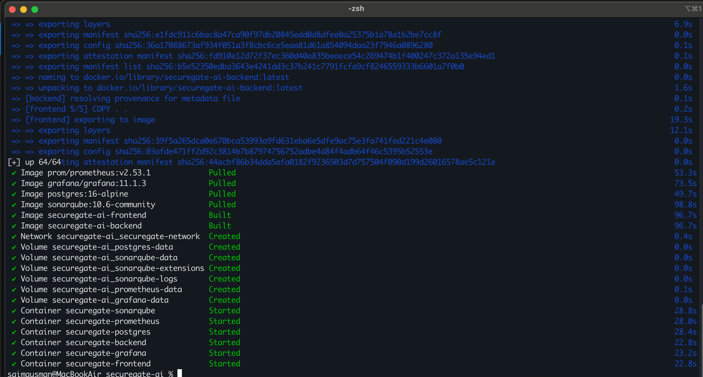

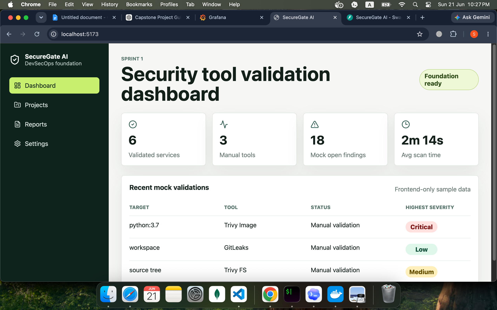

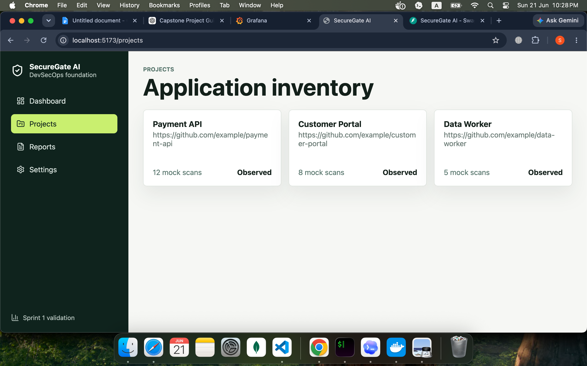

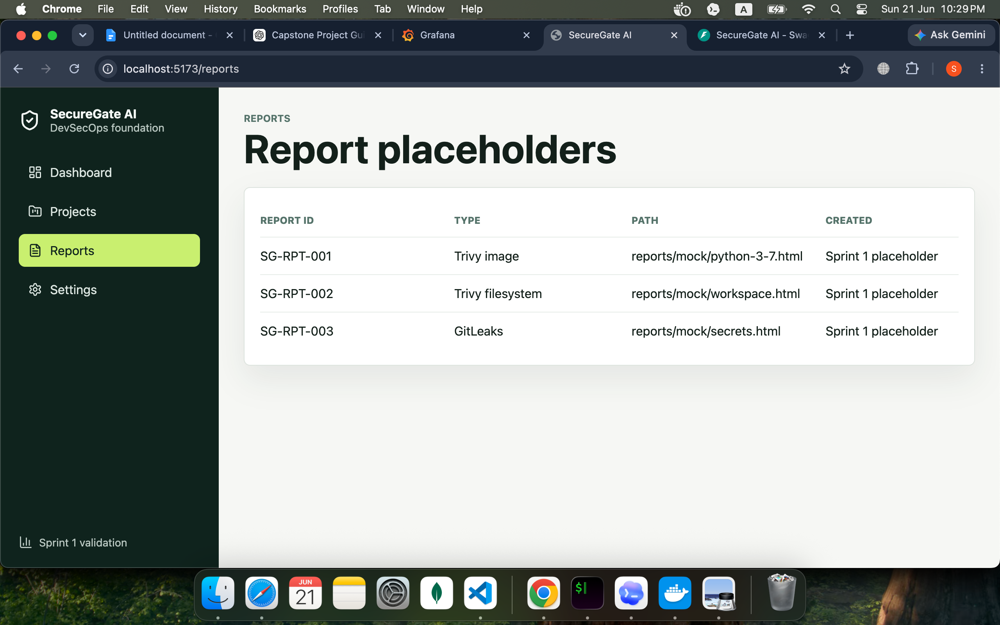

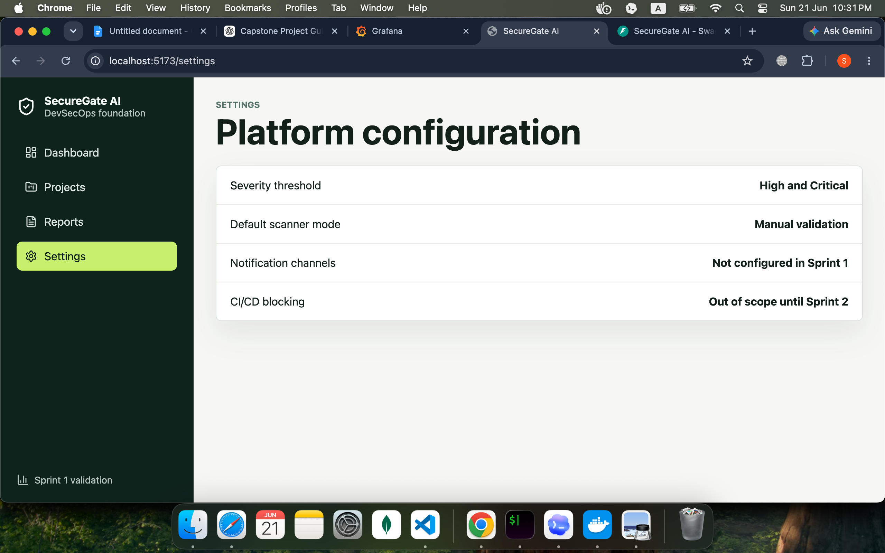

----

## FastAPI Backend

Open:
```
http://localhost:8000/docs
```

You should see `Swagger UI`.

Endpoints:
```
GET /
GET /health
```

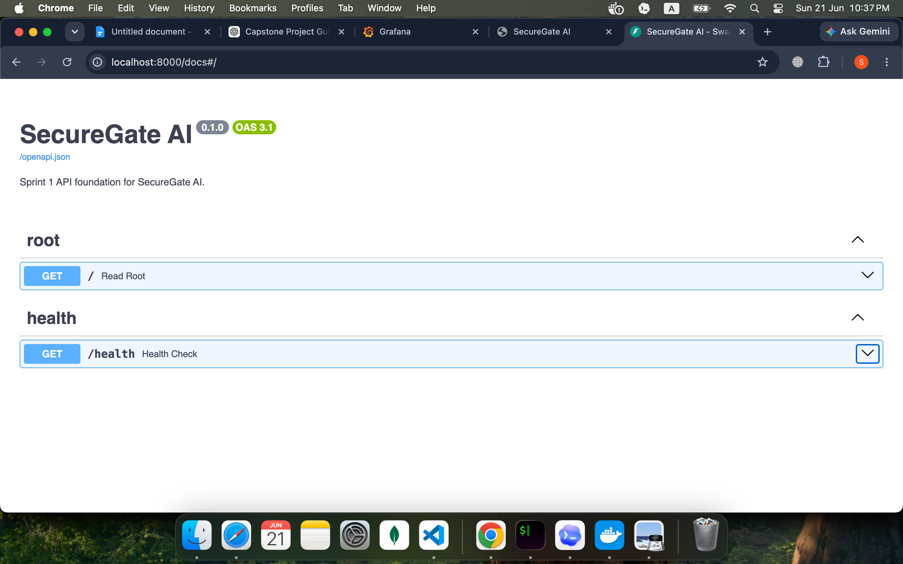


---

## Grafana

Open:
```
http://localhost:3000
```

✅ Login works. \
✅ No real dashboards yet. \
✅ Only setup completed.

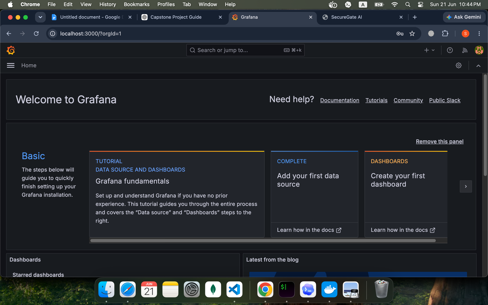

----

## Prometheus

Open:
```
http://localhost:9090
```

✅ Prometheus is collecting metrics. \
✅ Nothing exciting yet. \
✅ Just working.


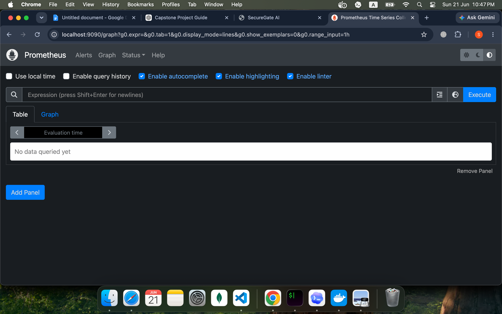

----

## SonarQube

Open:
```
http://localhost:9000
```

You can:

✅ Login \
✅ Create a project \
✅ Generate token \
✅ Scan a test repository


### Example results:

```
Code Smells: 25

Bugs: 3

Security Hotspots: 4

Coverage: 78% 
```


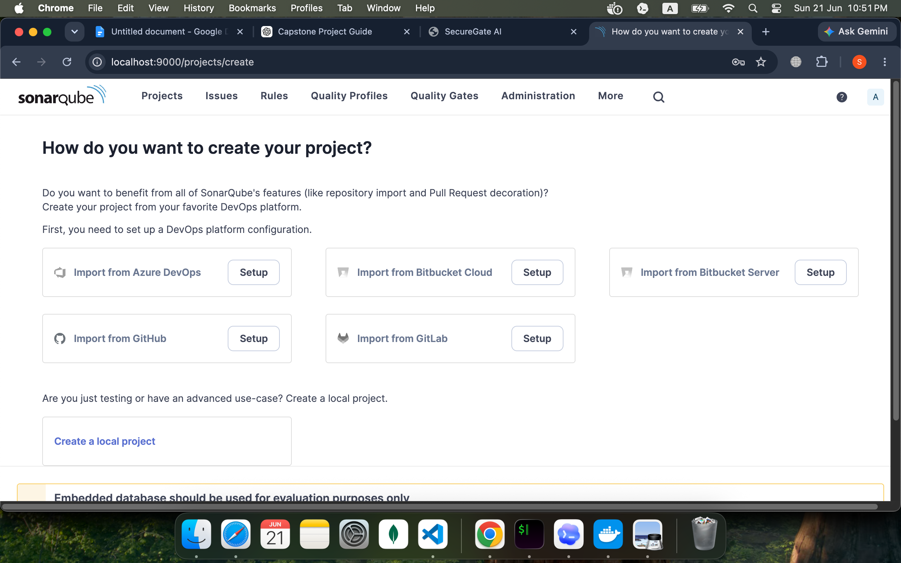

----

## PostgreSQL

✅ Database running. \
✅ Tables exist: \
    ✅ projects \
    ✅ scans \
    ✅ reports

You can verify:
```
SELECT * FROM projects;
```

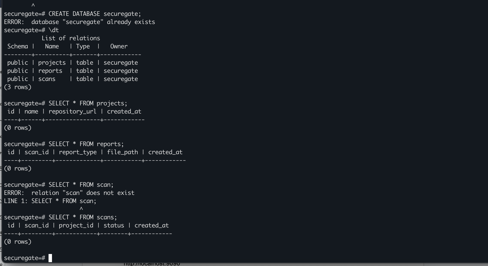

----


## Manual Tool Validation

GitLeaks:

```bash
gitleaks detect .
```

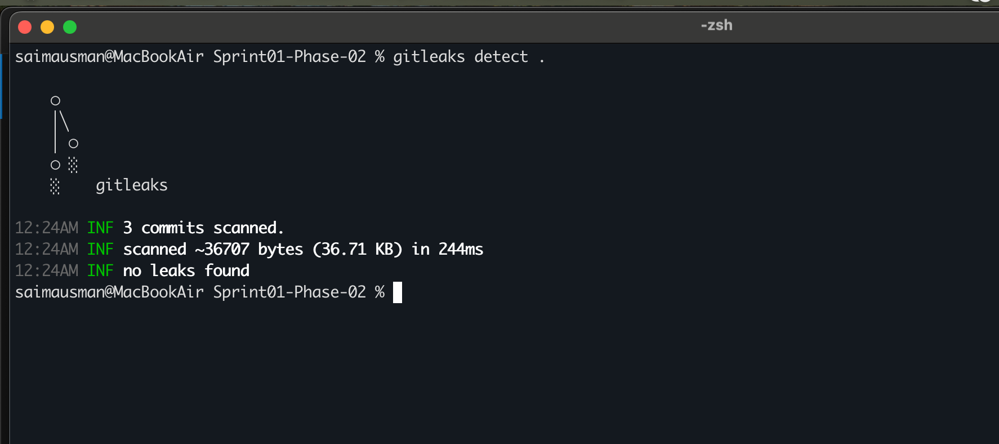


Trivy filesystem scan:

```bash
trivy fs .
```

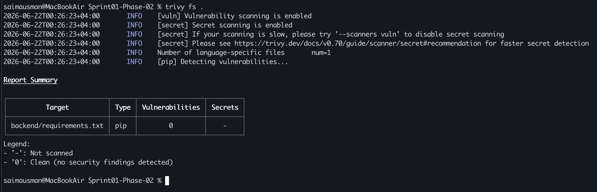


Trivy image scan:

```bash
trivy image python:3.7
```

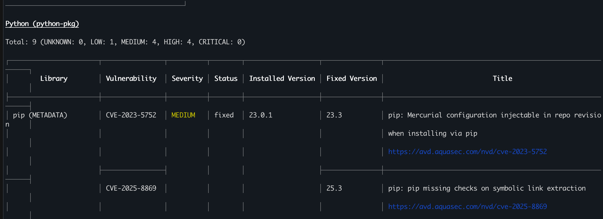

---

### For more Validation Check:

`docs/sprint-1/Tool-Validation.md`, \
`scanners/gitleaks/README.md`, and \
`scanners/trivy/README.md` for detailed validation steps.

---

## Project Tree (Sprint-1 Pahse-02)

```text
securegate-ai/
├── backend/
├── database/
├── docker/
├── docs/
│   └── sprint-1/
├── frontend/
├── monitoring/
│   ├── grafana/
│   └── prometheus/
├── reports/
├── scanners/
│   ├── gitleaks/
│   ├── sonarqube/
│   └── trivy/
├── scripts/
├── docker-compose.yml
└── README.md
```

----

## Summary 

Sprint 1 delivers a fully containerized SecureGate AI foundation with all core services deployed and all security scanning tools validated independently, ready for CI/CD automation in Sprint 2. 
