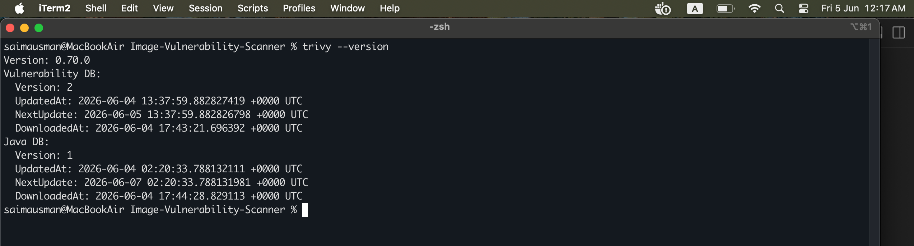
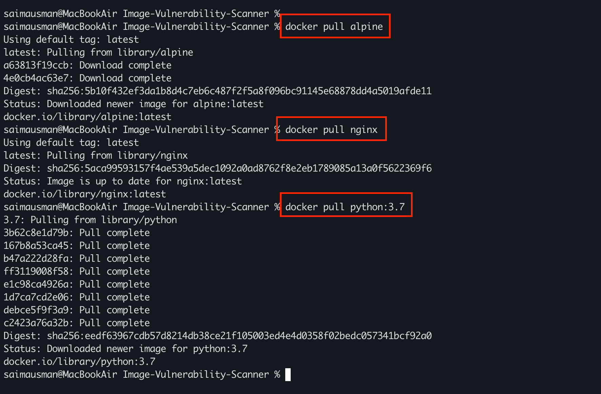
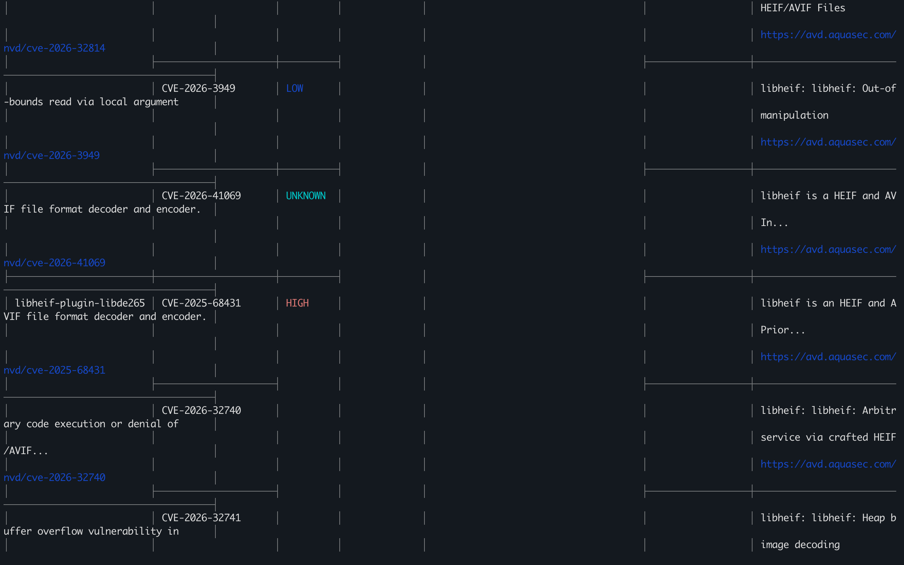
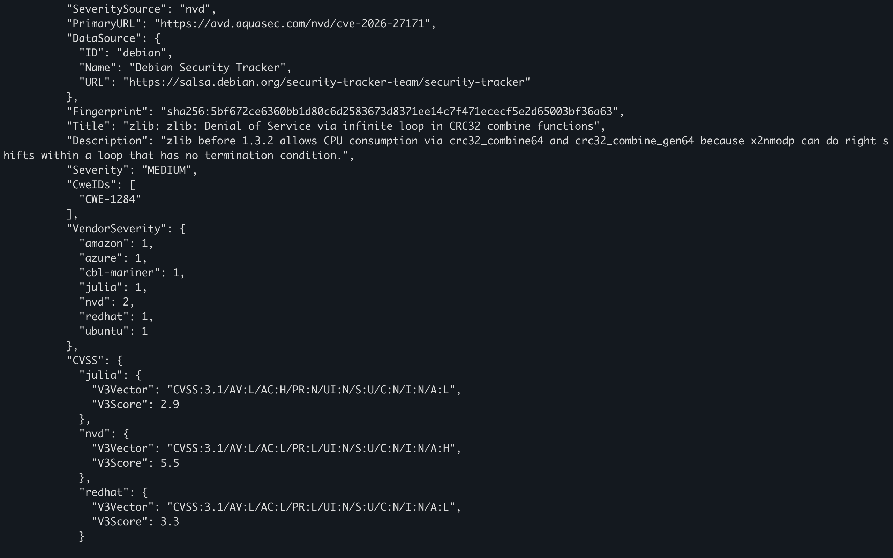
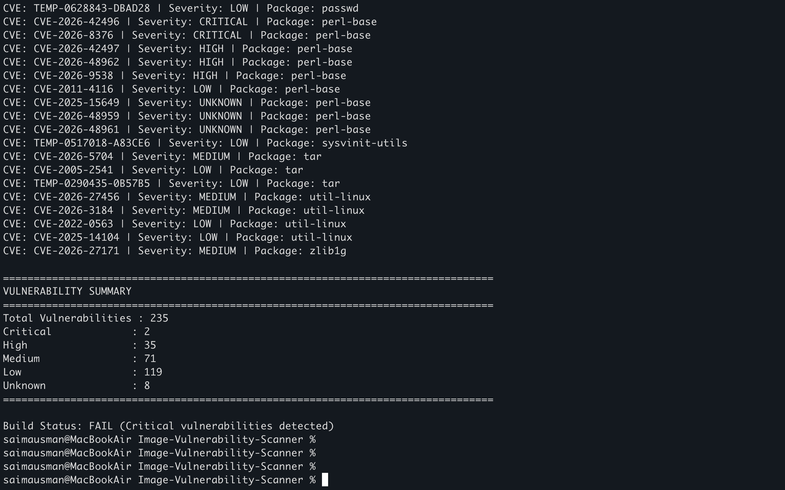

# Container Image Vulnerability Scanner with Reporting

## Sprint 1: Initial Setup and Basic Vulnerability Scanning

Sprint 1 focuses on establishing the foundation of the project by:

* Setting up the project structure
* Installing and configuring Trivy vulnerability scanner
* Scanning Docker container images
* Generating vulnerability reports in JSON format
* Parsing and analyzing scan results using Python

---

## Sprint 1 Objectives

The primary objectives of Sprint 1 are:

* Create the project repository and folder structure
* Install Docker and Trivy
* Pull sample container images
* Perform vulnerability scans
* Export scan reports in JSON format
* Develop a Python parser to analyze vulnerabilities
* Generate vulnerability summaries

---

## Technology Stack

| Component             | Technology |
| --------------------- | ---------- |
| Programming Language  | Python 3   |
| Container Runtime     | Docker     |
| Vulnerability Scanner | Trivy      |
| Report Format         | JSON       |
| Version Control       | Git        |
| Repository Hosting    | GitHub     |

---

## Project Structure

```text
Image-Vulnerability-Scanner/

├── scanner/
│   ├── scan.py
│   ├── parser.py
│   └── utils.py
│
├── reports/
│   └── nginx-reports.json
│
├── config/
│
├── docs/
│
├── tests/
│
├── README.md
│
└── image.png
```

---

## Prerequisites

Before running this project, ensure the following software is installed:

### Verify Python

```bash
python3 --version
```

Expected Output:

```text
Python 3.x.x
```

### Verify Docker

```bash
docker --version
```

Expected Output:

```text
Docker version xx.x.x
```

### Verify Trivy

```bash
trivy --version
```

Expected Output:



---

## Installing Trivy if not already installed

### macOS

```bash
brew install trivy
```

### Ubuntu

```bash
sudo apt-get install wget

wget https://github.com/aquasecurity/trivy/releases/latest/download/trivy_0.65.0_Linux-64bit.deb

sudo dpkg -i trivy_0.65.0_Linux-64bit.deb
```

Verify installation:

```bash
trivy --version
```

---

## Pulling Sample Docker Images

### Pull Nginx Image

```bash
docker pull nginx
```

Verify:

```bash
docker images
```

Expected:

```text
REPOSITORY   TAG
nginx        latest
```

Pull and scan some more images like alpine, nginx, python



---

## Running Vulnerability Scans

### Scan Python Image

```bash
trivy image python:3.7
```


> Older image. Likely many vulnerabilities.

----

### Scan Nginx Image

```bash
trivy image nginx
```




### Trivy performs the following:

* Downloads latest vulnerability database
* Inspects image layers
* Identifies vulnerable packages
* Maps vulnerabilities to CVE database
* Displays severity levels

---

## Generate JSON Report

Export scan results:

```bash
trivy image nginx -f json -o reports/nginx-reports.json
```

Verify report creation:

```bash
ls reports
```

Expected:

```text
nginx-reports.json
```



---

## Understanding Trivy Report

The JSON report contains:

### Target

The scanned image.

Example:

```json
"Target": "nginx:latest"
```

### Vulnerability ID

Example:

```json
"CVE-2025-1234"
```

### Severity

Possible values:

```text
CRITICAL
HIGH
MEDIUM
LOW
UNKNOWN
```

### Installed Version

Version currently present in the image.

Example:

```json
"InstalledVersion": "1.1.1"
```

### Fixed Version

Version that resolves the vulnerability.

Example:

```json
"FixedVersion": "1.1.2"
```

---

## Python Vulnerability Parser

The parser reads Trivy JSON reports and generates vulnerability statistics.

### Execute Parser

From the project root:

```bash
python scanner/parser.py
```



---

## Features Implemented

### Vulnerability Extraction

Extracts:

* CVE ID
* Severity
* Package Name
* Installed Version
* Fixed Version

### Vulnerability Counting

Counts vulnerabilities by:

* Critical
* High
* Medium
* Low
* Unknown

### Build Status Evaluation

Status Logic:

| Condition                        | Status  |
| -------------------------------- | ------- |
| Critical Vulnerabilities Found   | FAIL    |
| High Vulnerabilities Found       | WARNING |
| No High/Critical Vulnerabilities | PASS    |

---

## Sample Output

```text
Vulnerability Details

Target: nginx

CVE: CVE-2025-1234 | Severity: HIGH | Package: openssl

CVE: CVE-2025-5678 | Severity: CRITICAL | Package: glibc

===================================================

VULNERABILITY SUMMARY

Total Vulnerabilities : 25

Critical : 2

High : 8

Medium : 10

Low : 5

Unknown : 0

===================================================

Build Status: FAIL
```

---

## CVE Severity Levels

| Severity | CVSS Score |
| -------- | ---------- |
| Critical | 9.0 - 10.0 |
| High     | 7.0 - 8.9  |
| Medium   | 4.0 - 6.9  |
| Low      | 0.1 - 3.9  |

---

## Sprint 1 Deliverables

The following deliverables were completed during Sprint 1:

### Repository Setup

* GitHub repository created
* Project structure defined

### Vulnerability Scanner Setup

* Docker installed
* Trivy installed
* Trivy database initialized

### Container Image Scanning

* Pulled sample images
* Executed vulnerability scans
* Generated JSON reports

### Python Analysis Module

* Developed JSON parser
* Extracted vulnerability information
* Generated severity summaries

### Documentation

* Setup instructions documented
* Usage instructions documented
* Project architecture documented

---

## Challenges Encountered

### File Path Issues

Problem:

```text
FileNotFoundError
```

Resolution:

* Corrected report file path
* Standardized report naming convention

### Trivy Database Download

Problem:

Initial scans took longer due to database download.

Resolution:

* Allowed Trivy to initialize vulnerability database before scanning.

---

## Sprint 2 Preview

In Sprint 2, the project will be extended to include:

* Jenkins Integration
* GitHub Actions Integration
* Automated Vulnerability Scanning
* Build Failure Logic
* Severity Threshold Configuration
* CI/CD Security Gates

---

## Author

**Saima Usman** \
Jr. DevOps + Clouds Engineer \
HeroVired (PPMCAD-15)

**Capstone Project (Sprint-1 Implementation)** \
Container Image Vulnerability Scanner with Reporting

----
